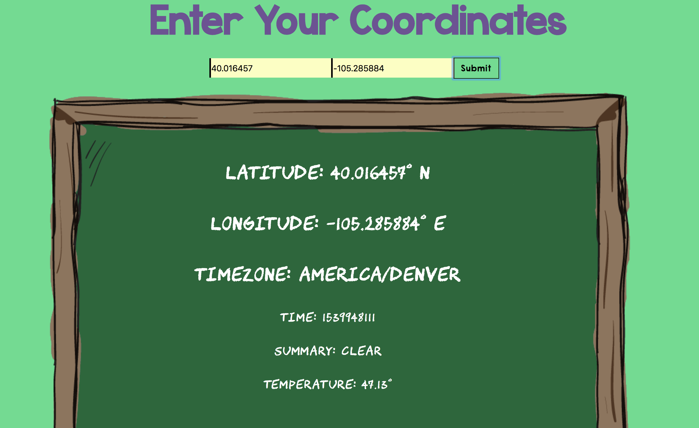

# Cognizant Code Challenge 

## Synopsis

This project is a ReactJS app using the Dark Sky API, a user can search through various coordinates and retrieve current weather conditions for each location.

### Usage 
#### Unzip file
```unzip valentino-code-challenge.zip```

#### Link to Repo
[Valentino's repo](https://github.com/valentinovtino/dark-sky-challenge-)

From here clone, down the repo run `npm install` and get started. 


### *Example* 



---

## Contributors

[Valentino Valentine](https://github.com/valentinovtino)
